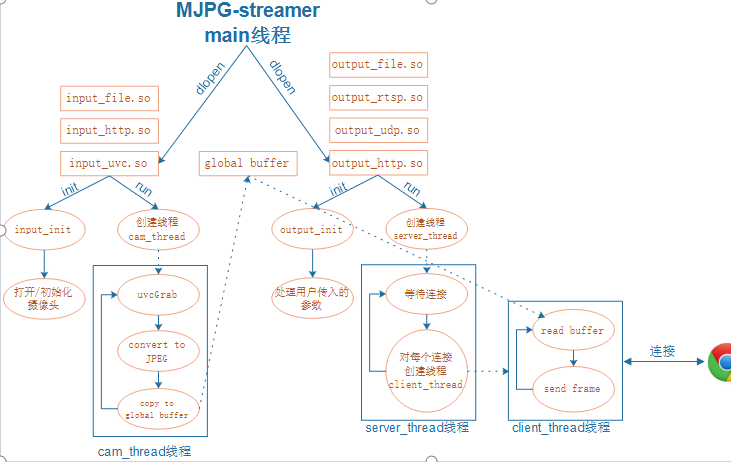
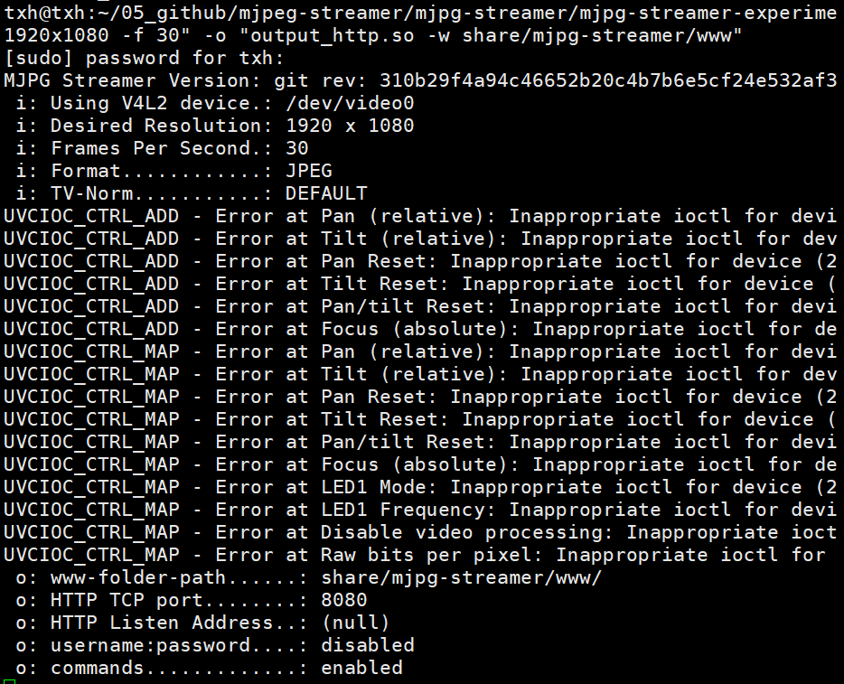
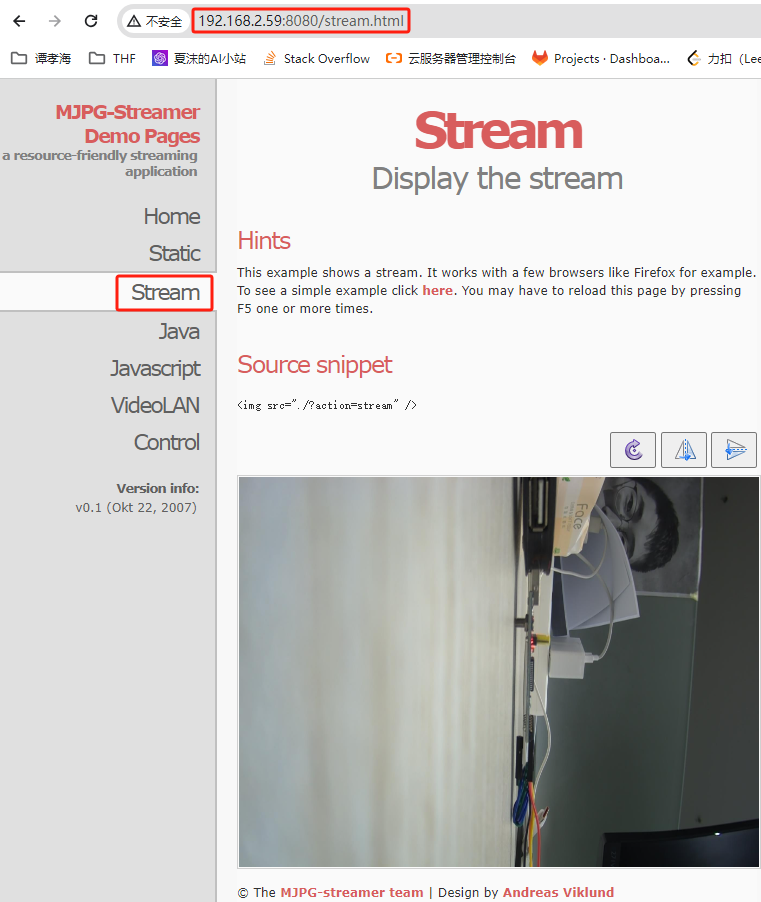

<!--
 * @Author: Clark
 * @Email: haixuanwoTxh@gmail.com
 * @Date: 2024-03-18 21:35:44
 * @LastEditors: Clark
 * @LastEditTime: 2024-03-18 23:24:21
 * @Description: file content
 *
-->
# mjpg-streamer
mjpg_streamer是一个开源的多线程实时视频流服务器，用于将视频流从摄像头捕获并通过网络传输。它支持多种摄像头设备，并提供了丰富的配置选项和功能。

mjpg_streamer基于Linux系统，使用C++编写。它使用了视频4 Linux 2（V4L2）接口来访问摄像头设备，并通过HTTP协议将视频流传输到客户端。
它还支持使用插件来扩展功能，例如添加图像处理、视频压缩、音频流等。

mjpg_streamer的主要特点包括：

- 多线程处理：能够同时处理多个客户端的请求，提供实时的视频流传输。
- 支持多种摄像头设备：包括USB摄像头、IP摄像头、摄像头模块等。
- 灵活的配置选项：可以通过配置文件或命令行参数进行配置，包括视频分辨率、帧率、图像质量等。
- 插件扩展：可以通过加载插件来添加额外的功能，如图像处理、视频压缩、音频流等。
- 跨平台支持：可以在Linux、Windows、Mac等操作系统上运行。
- 使用mjpg_streamer可以方便地搭建一个实时视频流服务器，用于监控、视频通信等应用场景。它的开源性质也使得用户可以根据自己的需求进行二次开发和定制。

- 支持多种视频编码格式：mjpg_streamer支持多种视频编码格式，包括MJPEG（Motion JPEG）、H.264等。用户可以根据需要选择适合的编码格式，以平衡视频质量和带宽消耗。

- 图像处理功能：mjpg_streamer可以通过加载插件来进行图像处理，例如调整亮度、对比度、饱和度等，或者应用特效和滤镜。这些功能可以增强视频流的质量或满足特定的需求。

- 安全性配置：mjpg_streamer支持基本的身份验证和访问控制，可以通过配置用户名和密码来限制对视频流的访问。这有助于保护视频流的安全性，防止未经授权的访问。

- 轻量级和低资源消耗：mjpg_streamer是一个轻量级的视频流服务器，具有较低的资源消耗。这使得它适用于嵌入式设备或资源有限的环境中使用。

总的来说，mjpg_streamer是一个功能强大、灵活且易于使用的视频流服务器，适用于各种实时视频流传输的应用场景。它的开源性质和丰富的配置选项使得用户可以根据自己的需求进行定制和扩展

- 轻量级和高效：mjpg_streamer是一个轻量级的视频流服务器，具有较小的内存占用和低的CPU负载。它能够高效地处理视频流，并提供实时的传输性能。
- 嵌入式系统支持：由于其低资源消耗和跨平台特性，mjpg_streamer非常适合在嵌入式系统中使用。它可以与嵌入式设备（如树莓派）配合使用，实现实时视频监控、远程控制等功能。
- 视频流嵌入网页：mjpg_streamer可以将视频流嵌入到网页中，通过浏览器进行访问和观看。这使得用户可以方便地在网页上查看实时视频，无需额外的客户端软件。
- 远程监控和视频通信：mjpg_streamer可以用于远程监控系统，用户可以通过网络访问摄像头的视频流，实时查看监控画面。此外，它还可以用于视频通信应用，例如视频会议、远程教育等。

总的来说，mjpg_streamer是一个功能丰富、易于使用的视频流服务器，适用于各种实时视频流传输和应用场景。它的跨平台支持、轻量级和高效的特性使得它成为一个理想的选择。

- 多路视频流支持：mjpg_streamer可以同时处理多个摄像头的视频流，并将它们通过网络传输。这使得它适用于需要监控多个区域或多个摄像头的场景，如安防监控系统。
- 视频录制功能：mjpg_streamer可以将视频流实时录制为视频文件，用户可以设置录制的时长、保存的格式等参数。这使得用户可以方便地进行视频录制和存档。
- 远程控制和配置：mjpg_streamer提供了远程控制和配置的接口，用户可以通过网络访问并进行摄像头的配置和控制。这使得用户可以远程调整摄像头的参数，如焦距、曝光等。
- 多种输出格式支持：除了常见的视频流输出，mjpg_streamer还支持将视频流输出为静态图像（如JPEG格式）或视频文件（如AVI格式）。这使得用户可以根据需要选择不同的输出格式。
- 开发和定制：mjpg_streamer是一个开源项目，用户可以根据自己的需求进行二次开发和定制。用户可以根据自己的需求添加新的功能、修改现有功能或进行性能优化。

总的来说，mjpg_streamer是一个功能强大、灵活且易于定制的视频流服务器，适用于各种实时视频流传输和应用场景。它的多路视频流支持、远程控制和配置、开发和定制等特点使得它具有广泛的应用潜力。

----------------------------------------------------------------------------------------------
commit 310b29f4a94c46652b20c4b7b6e5cf24e532af39 (HEAD -> master, origin/master, origin/HEAD)
Author: MichaIng <micha@dietpi.com>
Date:   Sat Feb 20 18:47:40 2021 +0100

    Add info about the existing host/IP binding option (#292)

    Signed-off-by: MichaIng <micha@dietpi.com>
----------------------------------------------------------------------------------------------

# 1、编译运行
git clone https://github.com/jacksonliam/mjpg-streamer.git
cd mjpg-streamer;git checkout 310b29f4a94c46652b20c4b7b6e5cf24e532af39
cd mjpg-streamer-experimental
mkdir build install
cd build
cmake -DCMAKE_INSTALL_PREFIX=`pwd`/../install ..
make -j16 && make install
cd ../install
export LD_LIBRARY_PATH=`pwd`/lib/mjpg-streamer
sudo ./bin/mjpg_streamer -i "input_uvc.so -d /dev/video0 -r 640x480 -f 30" -o "output_http.so -w share/mjpg-streamer/www"

# 2、在web端拉流
在浏览器输入ip和端口，例如：192.168.2.59:8080

