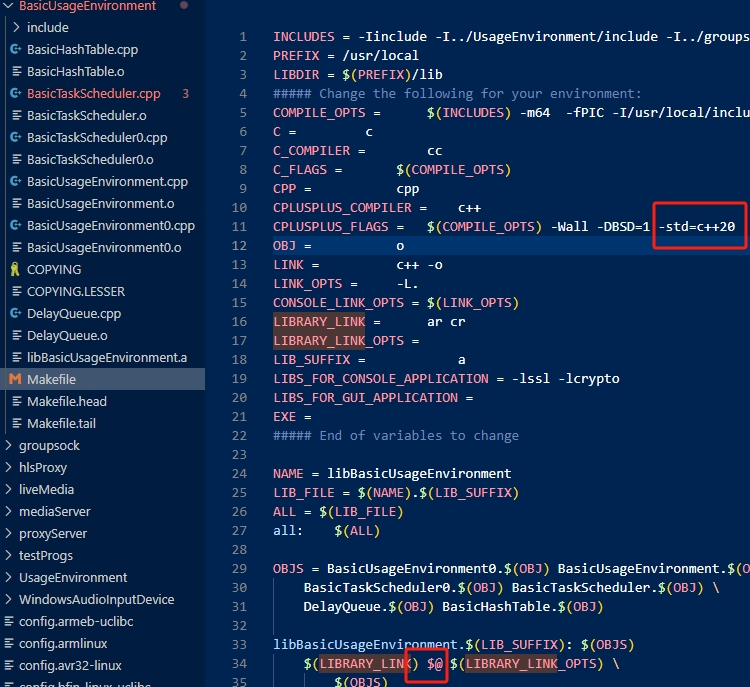

<!--
 * @Author: Clark
 * @Email: haixuanwoTxh@gmail.com
 * @Date: 2024-03-27 22:04:36
 * @LastEditors: Clark
 * @LastEditTime: 2024-04-01 11:23:50
 * @Description: file content
-->

# 一、URL
## 1、wiki
https://en.wikipedia.org/wiki/Real-Time_Streaming_Protocol

ARM交叉编译
https://blog.csdn.net/u014552102/article/details/131265296

## 2、Real Time Streaming Protocol (RTSP)
RTSP 1.0
https://www.rfc-editor.org/rfc/rfc2326
https://datatracker.ietf.org/doc/html/rfc2326
RTSP 2.0
https://datatracker.ietf.org/doc/html/rfc7826

# 3、office website
http://live555.com
http://live555.com/liveMedia/
https://download.videolan.org/pub/contrib/live555/

# 二、编译测试

mkdir install
7z x live.2024.03.08_alreadyChange.7z
cd live; ./genMakefiles linux-64bit
make -j16
make install

cd ../install/
拷贝test.mkv文件到install目录下
./bin/live555MediaServer

在VLC播放器中打开网络串流，输入rtsp://127.0.0.1:8554/test.mk
就能拉取到视频流了。
